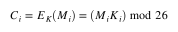
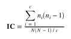
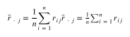
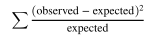

# vigenere-solver

A simple vigenere solver using Index of Coincidence, Friedman and Chi-squared

## Vigenère

Created by Giovan Battista Bellaso in 1553, a simple cipher to implement but quite hard to break it. Being even called as _"The indecipherable cipher"_, remaining like that for 3 centuries.

It consists on a series of ceasar ciphers interlaced.

 

## Index of coincidence

Created by William F. Friedman in 1922, a technique for counting the amount of repetition of letters. Since natural language aren't evenly distributed, the IoC of a text in natural language should be greater than a random scrambled text.

 

## Friedman test

Created by William F. Friedman around 1920s, it is a method to determine the used key length used for ciphering a given text in vigenère.
Basically calculating the IoC of every chunk of text separated by a given guessed key-length. The length with the greatest IoC, should be considered as the probable key length, or at least a common multiplier is shared.

 
 

## Chi-squared test

It uses chi-squared distribution to evaluate a goodness fit, testing whether an observed value and an expected value share the same frequencies.

 
 

---

## How to use it
Follow the steps bellow to run it
- Make sure you have NodeJS installed on your machine
- Clone the repository
- Install dependencies by executing `npm install`
- Run the code by executing `npm start` or `node src/main.js`